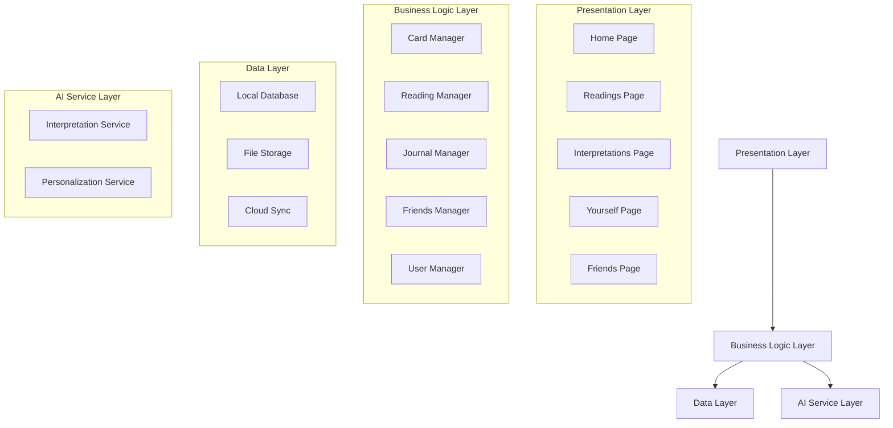

# Design Document

## Overview

Lunanul is a Flutter mobile application designed as a tranquil, personal tarot reading companion. The app combines AI-powered readings with manual interpretation tools, personal journaling, and private friend connections. The architecture emphasizes clean separation of concerns, offline-first capabilities, and a calming user experience through thoughtful animations and minimalist design.

## Architecture

### High-Level Architecture



### State Management

The app will use **Riverpod** for state management, providing:
- Reactive state updates across the app
- Dependency injection for services
- Easy testing and mocking capabilities
- Automatic disposal of resources

### Data Flow

1. **User Interactions** → UI Components
2. **UI Components** → Riverpod Providers
3. **Providers** → Business Logic Services
4. **Services** → Mock API Services (Frontend Focus)
5. **Mock Services** → Local Storage & Cached Data

## Components and Interfaces

### Core Models

```dart
// Card model representing a tarot card
class TarotCard {
  final String id;
  final String name;
  final String suit;
  final String imageUrl;
  final String uprightMeaning;
  final String reversedMeaning;
  final bool isReversed;
}

// Reading model for complete tarot readings
class Reading {
  final String id;
  final DateTime createdAt;
  final ReadingTopic topic;
  final List<CardPosition> cards;
  final String? userReflection;
  final bool isSaved;
}

// Card position in a spread
class CardPosition {
  final TarotCard card;
  final String positionName;
  final String aiInterpretation;
}
```

### Key Services

#### CardService
- Manages the 78-card tarot deck
- Provides card shuffling and selection
- Handles card image loading and caching

#### ReadingService
- Orchestrates AI-powered readings
- Manages spread configurations
- Generates contextual interpretations

#### JournalService
- Handles reading persistence
- Manages user reflections and notes
- Provides reading history and statistics

#### FriendsService
- Manages friend connections
- Handles reading sharing
- Maintains private chat threads

### UI Components Architecture

#### Navigation Structure
```
BottomNavigationBar
├── Home (Index 0)
├── Readings (Index 1)
├── Interpretations (Index 2)
├── Yourself (Index 3)
└── Friends (Index 4)
```

#### Reusable Components
- **CardWidget**: Animated tarot card display with flip animations
- **ReadingSpreadWidget**: Configurable layout for different spreads
- **TopicSelectorWidget**: Beautiful topic selection interface
- **JournalEntryWidget**: Reading history display component
- **ChatBubbleWidget**: Private conversation messages

## Data Models

### Firestore Collections Structure

```
users/
├── {userId}/
    ├── name: string
    ├── createdAt: timestamp
    └── readings/
        ├── {readingId}/
            ├── topic: string
            ├── spreadType: string
            ├── createdAt: timestamp
            ├── userReflection: string?
            ├── isSaved: boolean
            └── cards: array[
                ├── cardId: string
                ├── positionName: string
                ├── aiInterpretation: string
                └── isReversed: boolean
            ]

friends/
├── {friendshipId}/
    ├── userId: string
    ├── friendUserId: string
    ├── status: string (pending, accepted, blocked)
    └── createdAt: timestamp

sharedReadings/
├── {sharedReadingId}/
    ├── readingId: string
    ├── sharedByUserId: string
    ├── sharedWithUserId: string
    ├── sharedAt: timestamp
    └── messages/
        ├── {messageId}/
            ├── senderUserId: string
            ├── message: string
            └── sentAt: timestamp
```

### Mock API Services (Frontend Focus)

For frontend development, we'll create mock services that simulate Firestore operations:

```dart
// Mock services for frontend development
class MockReadingService {
  Future<Reading> createReading(ReadingTopic topic, List<TarotCard> cards) async {
    // Simulate API delay
    await Future.delayed(Duration(milliseconds: 500));
    // Return mock reading with AI interpretations
  }
}

class MockUserService {
  Future<User> getCurrentUser() async {
    // Return mock user data
  }
}
```

### Card Data Structure and Image Caching

Cards will be stored as JSON assets with remote image URLs for caching:
```json
{
  "cards": [
    {
      "id": "fool",
      "name": "The Fool",
      "suit": "major_arcana",
      "number": 0,
      "imageUrl": "https://api.lunanul.com/cards/fool.png",
      "keywords": ["new beginnings", "innocence", "adventure"],
      "uprightMeaning": "New beginnings, innocence, spontaneity...",
      "reversedMeaning": "Recklessness, taken advantage of..."
    }
  ]
}
```

### Image Caching Strategy

To keep the app size small while providing beautiful card images:

1. **Remote Images**: All tarot card images hosted remotely
2. **Progressive Loading**: Cards load as needed during app usage
3. **Persistent Caching**: Use `cached_network_image` package for automatic caching
4. **Placeholder Images**: Simple, elegant placeholders while images load
5. **Cache Management**: Automatic cleanup of old cached images

```dart
// Image caching implementation
class CardImageWidget extends StatelessWidget {
  final String imageUrl;
  
  Widget build(BuildContext context) {
    return CachedNetworkImage(
      imageUrl: imageUrl,
      placeholder: (context, url) => CardPlaceholder(),
      errorWidget: (context, url, error) => CardErrorWidget(),
      fadeInDuration: Duration(milliseconds: 300),
    );
  }
}
```

## Error Handling

### Error Categories
1. **Network Errors**: AI service unavailable, slow connections
2. **Data Errors**: Corrupted readings, missing cards
3. **User Errors**: Invalid inputs, permission denials
4. **System Errors**: Storage full, app crashes

### Error Handling Strategy
- **Graceful Degradation**: App functions offline without AI features
- **User-Friendly Messages**: Clear, non-technical error explanations
- **Retry Mechanisms**: Automatic retry for transient failures
- **Fallback Content**: Default interpretations when AI is unavailable

### Implementation
```dart
class AppError {
  final String message;
  final ErrorType type;
  final String? technicalDetails;
  
  // Factory constructors for different error types
  factory AppError.network(String message) => ...
  factory AppError.data(String message) => ...
}

// Global error handling with Riverpod
final errorProvider = StateNotifierProvider<ErrorNotifier, AppError?>(...);
```

## Frontend-Focused Architecture

### Mock Data Strategy
Since we're focusing on frontend development, we'll implement comprehensive mock services:

1. **Mock Reading Service**: Simulates AI-powered interpretations with realistic delays
2. **Mock User Service**: Handles user authentication and profile management
3. **Mock Friends Service**: Manages friend connections and sharing
4. **Local Storage**: Use SharedPreferences for temporary data persistence during development

### Development Approach
- Build complete UI/UX without backend dependencies
- Implement realistic loading states and animations
- Create comprehensive mock data sets for testing different scenarios
- Focus on smooth user experience and visual polish

## UI/UX Design Considerations

### Design System
- **Color Palette**: Calming purples, deep blues, soft golds
- **Typography**: Clean, readable fonts with good hierarchy
- **Spacing**: Generous whitespace for tranquil feeling
- **Animations**: Smooth, purposeful transitions

### Accessibility
- **Screen Reader Support**: Semantic labels for all interactive elements
- **High Contrast**: Alternative color schemes for visibility
- **Font Scaling**: Support for system font size preferences
- **Touch Targets**: Minimum 44px touch targets

### Performance Considerations
- **Image Caching**: Use `cached_network_image` for efficient card image management
- **Animation Performance**: 60fps animations using Flutter's animation system
- **Memory Management**: Proper disposal of resources and controllers
- **Startup Time**: Fast app launch with progressive image loading
- **Cache Size Management**: Automatic cleanup of cached images to prevent storage bloat

### Image Loading Strategy
- **Progressive Enhancement**: App functions with placeholder images while real images load
- **Bandwidth Awareness**: Respect user's data preferences
- **Cache Persistence**: Images remain cached between app sessions
- **Fallback Handling**: Graceful handling of failed image loads with elegant error states