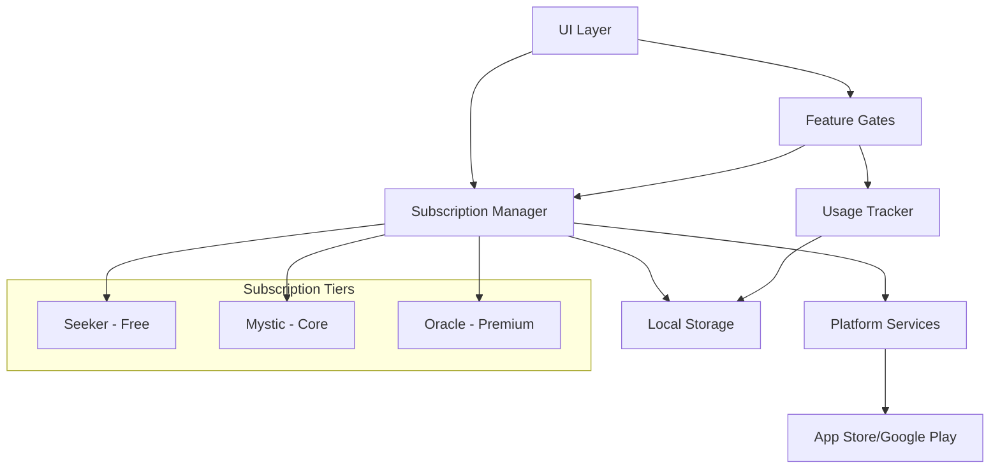
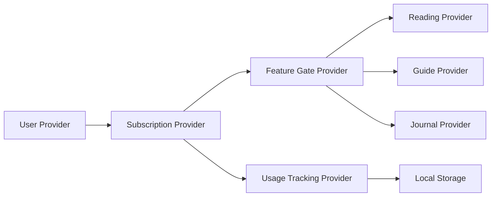

# Design Document

## Overview

The Lunanul Subscription Model design integrates a three-tier monetization system into the existing Flutter app architecture using Riverpod state management. The design leverages platform-native subscription services (App Store/Google Play) while maintaining the app's tranquil spiritual atmosphere. The system is built around usage tracking, feature gating, and seamless subscription management that enhances rather than disrupts the user experience.

## Architecture

### High-Level Architecture



### State Management Integration

The subscription system integrates with the existing Riverpod architecture by extending current providers and adding new subscription-specific providers:



## Components and Interfaces

### Core Models

#### SubscriptionTier Enum
```dart
enum SubscriptionTier {
  seeker,    // Free tier
  mystic,    // Core subscription ($4.99/month)
  oracle     // Premium subscription ($9.99/month)
}
```

#### SubscriptionStatus Model
```dart
class SubscriptionStatus {
  final SubscriptionTier tier;
  final bool isActive;
  final DateTime? expirationDate;
  final String? platformSubscriptionId;
  final Map<String, int> usageCounts;
  final DateTime lastUpdated;
}
```

#### FeatureAccess Model
```dart
class FeatureAccess {
  final bool hasUnlimitedReadings;
  final List<SpreadType> availableSpreads;
  final List<GuideType> availableGuides;
  final int maxJournalEntries;
  final int maxManualInterpretations;
  final bool isAdFree;
  final bool hasAudioReadings;
  final bool hasAdvancedSpreads;
  final bool hasCustomization;
}
```

### Service Layer

#### SubscriptionService
Handles platform integration and subscription management:
```dart
abstract class SubscriptionService {
  Future<SubscriptionStatus> getSubscriptionStatus();
  Future<List<SubscriptionProduct>> getAvailableProducts();
  Future<bool> purchaseSubscription(String productId);
  Future<bool> restoreSubscriptions();
  Stream<SubscriptionStatus> subscriptionStatusStream();
}
```

#### FeatureGateService
Manages feature access control:
```dart
abstract class FeatureGateService {
  bool canAccessFeature(String featureKey);
  bool canPerformAction(String actionKey);
  FeatureAccess getFeatureAccess(SubscriptionTier tier);
  Future<bool> checkUsageLimit(String feature);
  Future<void> incrementUsage(String feature);
}
```

#### UsageTrackingService
Tracks feature usage for free tier limitations:
```dart
abstract class UsageTrackingService {
  Future<int> getUsageCount(String feature);
  Future<void> incrementUsage(String feature);
  Future<void> resetMonthlyUsage();
  Future<Map<String, int>> getAllUsageCounts();
}
```

### Provider Layer

#### SubscriptionProvider
Central subscription state management:
```dart
final subscriptionProvider = StateNotifierProvider<SubscriptionNotifier, AsyncValue<SubscriptionStatus>>();
```

#### FeatureGateProvider
Feature access control:
```dart
final featureGateProvider = Provider<FeatureGateService>();
final featureAccessProvider = Provider<FeatureAccess>();
```

#### UsageTrackingProvider
Usage monitoring for free tier:
```dart
final usageTrackingProvider = StateNotifierProvider<UsageTrackingNotifier, Map<String, int>>();
```

### UI Components

#### SubscriptionGate Widget
Wraps features that require subscription access:
```dart
class SubscriptionGate extends ConsumerWidget {
  final Widget child;
  final String featureKey;
  final Widget? upgradePrompt;
  final SubscriptionTier requiredTier;
}
```

#### UpgradePrompt Widget
Displays subscription upgrade options:
```dart
class UpgradePrompt extends ConsumerWidget {
  final String featureContext;
  final SubscriptionTier recommendedTier;
  final VoidCallback? onDismiss;
}
```

#### SubscriptionManagement Widget
Handles subscription selection and management:
```dart
class SubscriptionManagement extends ConsumerWidget {
  final bool showCurrentStatus;
  final bool allowUpgrade;
  final bool allowDowngrade;
}
```

## Data Models

### Subscription Configuration
```dart
class SubscriptionConfig {
  static const Map<SubscriptionTier, FeatureAccess> tierFeatures = {
    SubscriptionTier.seeker: FeatureAccess(
      hasUnlimitedReadings: false,
      availableSpreads: [SpreadType.singleCard, SpreadType.threeCard],
      availableGuides: [GuideType.healer, GuideType.mentor],
      maxJournalEntries: 3,
      maxManualInterpretations: 5,
      isAdFree: false,
      hasAudioReadings: false,
      hasAdvancedSpreads: false,
      hasCustomization: false,
    ),
    // ... other tiers
  };
}
```

### Usage Limits
```dart
class UsageLimits {
  static const Map<String, int> monthlyLimits = {
    'manual_interpretations': 5,
    'journal_entries': 3,
  };
  
  static const Map<String, List<SpreadType>> tierSpreads = {
    'seeker': [SpreadType.singleCard, SpreadType.threeCard],
    'mystic': SpreadType.values,
    'oracle': SpreadType.values,
  };
}
```

## Error Handling

### Subscription Errors
```dart
enum SubscriptionError {
  networkError,
  platformError,
  invalidProduct,
  purchaseCancelled,
  subscriptionExpired,
  verificationFailed
}

class SubscriptionException implements Exception {
  final SubscriptionError error;
  final String message;
  final dynamic originalError;
}
```

### Graceful Degradation
- Network failures: Cache last known subscription status
- Platform errors: Allow temporary access with retry mechanism
- Verification failures: Provide offline mode with limited features

### Error Recovery
```dart
class SubscriptionErrorHandler {
  static Future<void> handleError(SubscriptionException error) async {
    switch (error.error) {
      case SubscriptionError.networkError:
        // Retry with exponential backoff
        break;
      case SubscriptionError.subscriptionExpired:
        // Gracefully downgrade to free tier
        break;
      // ... other cases
    }
  }
}
```

## Testing Strategy

### Unit Tests
- **Model Tests**: Subscription status, feature access calculations
- **Service Tests**: Mock platform services, usage tracking logic
- **Provider Tests**: State management, subscription status updates

### Widget Tests
- **SubscriptionGate**: Feature blocking and upgrade prompts
- **UpgradePrompt**: UI rendering and user interactions
- **SubscriptionManagement**: Subscription flow and error states

### Integration Tests
- **Subscription Flow**: End-to-end purchase and activation
- **Feature Gating**: Cross-feature access control
- **Usage Tracking**: Limit enforcement and reset cycles

### Platform Tests
- **iOS**: App Store Connect integration
- **Android**: Google Play Billing integration
- **Cross-platform**: Subscription restoration and sync

## Implementation Phases

### Phase 1: Core Infrastructure
1. Create subscription models and enums
2. Implement basic subscription service interface
3. Add subscription provider to Riverpod setup
4. Create feature gate service foundation

### Phase 2: Feature Gating
1. Implement usage tracking service
2. Add subscription gates to existing features
3. Create upgrade prompt components
4. Integrate with reading, guide, and journal providers

### Phase 3: Platform Integration
1. Implement iOS App Store integration
2. Implement Android Google Play integration
3. Add subscription restoration
4. Handle platform-specific error cases

### Phase 4: UI/UX Enhancement
1. Create subscription management screens
2. Add tier comparison interface
3. Implement upgrade prompts and flows
4. Add subscription status indicators

### Phase 5: Advanced Features
1. Implement Oracle tier features (audio, advanced spreads)
2. Add customization options
3. Implement early access system
4. Add subscription analytics and insights

## Security Considerations

### Subscription Verification
- Server-side receipt validation for iOS
- Google Play Developer API verification for Android
- Encrypted local storage for subscription status
- Regular subscription status refresh

### Feature Access Control
- Client-side feature gating with server validation
- Tamper-resistant usage tracking
- Secure storage of subscription credentials
- Rate limiting for subscription checks

### Privacy Protection
- Minimal data collection for subscription management
- Secure handling of platform subscription IDs
- User consent for subscription-related analytics
- GDPR compliance for subscription data

## Performance Optimization

### Caching Strategy
- Cache subscription status locally with TTL
- Preload feature access permissions
- Batch usage tracking updates
- Optimize subscription status checks

### Network Efficiency
- Minimize subscription verification calls
- Use platform webhooks where available
- Implement offline mode for cached subscriptions
- Compress subscription data payloads

### Memory Management
- Lazy load subscription-related services
- Dispose of unused subscription streams
- Optimize provider dependency chains
- Cache feature access calculations

## Monitoring and Analytics

### Subscription Metrics
- Conversion rates by tier
- Churn analysis and retention
- Feature usage by subscription tier
- Revenue tracking and forecasting

### User Experience Metrics
- Upgrade prompt effectiveness
- Feature discovery rates
- Subscription flow completion rates
- Error rates and recovery success

### Technical Metrics
- Subscription verification latency
- Platform integration reliability
- Feature gate performance
- Usage tracking accuracy