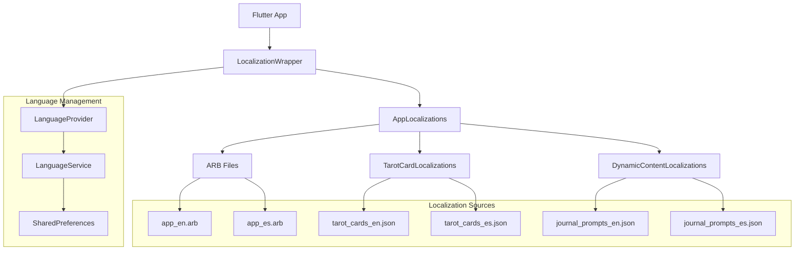

# Design Document

## Overview

The multi-language support feature will implement Flutter's official internationalization (i18n) framework using `flutter_localizations` and `intl` packages. The system will provide comprehensive localization for English and Spanish, including UI text, tarot card content, and dynamic messages. The design emphasizes maintainability, performance, and cultural authenticity while preserving the app's tranquil spiritual atmosphere across both languages.

## Architecture

### High-Level Localization Architecture



### Localization Strategy

The implementation will use Flutter's official `intl` package with ARB (Application Resource Bundle) files for UI text and separate JSON files for dynamic content like tarot card meanings and journal prompts. This hybrid approach provides:

1. **Type-safe UI translations** via generated AppLocalizations class
2. **Flexible dynamic content** for tarot cards and prompts
3. **Easy maintenance** with separate concerns
4. **Performance optimization** through lazy loading

## Components and Interfaces

### Core Localization Classes

```dart
// Generated AppLocalizations class (via intl)
abstract class AppLocalizations {
  static AppLocalizations of(BuildContext context);
  static const LocalizationsDelegate<AppLocalizations> delegate;
  static const List<LocalizationsDelegate<dynamic>> localizationsDelegates;
  static const List<Locale> supportedLocales;
  
  // UI Text Methods
  String get appTitle;
  String get homeTitle;
  String get cardOfTheDay;
  String get tapToReveal;
  String get recentReadings;
  String get dailyReflection;
  String goodMorning(String name);
  String goodAfternoon(String name);
  String goodEvening(String name);
  // ... more UI strings
}

// Language management service
class LanguageService {
  static const String _languageKey = 'selected_language';
  
  Future<Locale> getSavedLanguage();
  Future<void> saveLanguage(Locale locale);
  Locale getDeviceLocale();
  bool isSupported(Locale locale);
}

// Tarot card localization service
class TarotCardLocalizations {
  final Map<String, Map<String, dynamic>> _localizedCards;
  
  String getCardName(String cardId, Locale locale);
  String getUprightMeaning(String cardId, Locale locale);
  String getReversedMeaning(String cardId, Locale locale);
  List<String> getKeywords(String cardId, Locale locale);
}

// Dynamic content localization service
class DynamicContentLocalizations {
  final Map<String, List<String>> _journalPrompts;
  
  String getJournalPrompt(int index, Locale locale);
  String getTopicDescription(ReadingTopic topic, Locale locale);
  String getSpreadDescription(String spreadId, Locale locale);
}
```

### Language Provider with Riverpod

```dart
// Language state management
class LanguageNotifier extends StateNotifier<Locale> {
  final LanguageService _languageService;
  
  LanguageNotifier(this._languageService) : super(const Locale('en'));
  
  Future<void> initialize() async {
    final savedLanguage = await _languageService.getSavedLanguage();
    state = savedLanguage;
  }
  
  Future<void> changeLanguage(Locale newLocale) async {
    await _languageService.saveLanguage(newLocale);
    state = newLocale;
  }
}

// Riverpod providers
final languageServiceProvider = Provider<LanguageService>((ref) => LanguageService());

final languageProvider = StateNotifierProvider<LanguageNotifier, Locale>((ref) {
  return LanguageNotifier(ref.read(languageServiceProvider));
});

final tarotCardLocalizationsProvider = Provider<TarotCardLocalizations>((ref) {
  return TarotCardLocalizations();
});

final dynamicContentLocalizationsProvider = Provider<DynamicContentLocalizations>((ref) {
  return DynamicContentLocalizations();
});
```

## Data Models

### ARB File Structure

**app_en.arb (English)**
```json
{
  "@@locale": "en",
  "appTitle": "Lunanul",
  "@appTitle": {
    "description": "The application title"
  },
  "homeTitle": "Home",
  "cardOfTheDay": "Card of the Day",
  "tapToReveal": "Tap the card to reveal your daily guidance",
  "recentReadings": "Recent Readings",
  "dailyReflection": "Daily Reflection",
  "goodMorning": "Good morning, {name}",
  "@goodMorning": {
    "description": "Morning greeting with user name",
    "placeholders": {
      "name": {
        "type": "String",
        "example": "Sarah"
      }
    }
  },
  "goodAfternoon": "Good afternoon, {name}",
  "goodEvening": "Good evening, {name}",
  "welcomeMessage": "Welcome to your personal sanctuary of reflection and insight.",
  "noReadingsYet": "No readings yet",
  "startReading": "Start Reading",
  "newCard": "New Card",
  "journal": "Journal",
  "viewAll": "View All",
  "reflect": "Reflect",
  "newPrompt": "New prompt",
  "selectReadingContext": "Select reading context",
  "chooseAreaOfLife": "Choose the area of life you want to explore",
  "addYourCards": "Add your cards",
  "selectCardsFromDeck": "Select the cards you drew from your physical deck",
  "addCardFromDeck": "Add Card from Deck",
  "clearAll": "Clear All",
  "saveReading": "Save Reading",
  "saveInterpretation": "Save Interpretation",
  "personalNotes": "Personal notes (optional)",
  "addThoughts": "Add your thoughts about this reading...",
  "cancel": "Cancel",
  "save": "Save",
  "retry": "Retry",
  "loading": "Loading...",
  "error": "Error",
  "unableToLoad": "Unable to load",
  "pleaseSelectContext": "Please select a reading context first",
  "interpretationSaved": "Interpretation saved to journal",
  "failedToSave": "Failed to save",
  "drawingCard": "Drawing your card...",
  "loadingReadings": "Loading readings...",
  "topicSelf": "Self",
  "topicLove": "Love", 
  "topicWork": "Work",
  "topicSocial": "Social",
  "topicSelfDescription": "Personal growth and self-discovery",
  "topicLoveDescription": "Relationships and emotional connections",
  "topicWorkDescription": "Career and professional life",
  "topicSocialDescription": "Community and social interactions"
}
```

**app_es.arb (Spanish)**
```json
{
  "@@locale": "es",
  "appTitle": "Lunanul",
  "homeTitle": "Inicio",
  "cardOfTheDay": "Carta del Día",
  "tapToReveal": "Toca la carta para revelar tu guía diaria",
  "recentReadings": "Lecturas Recientes",
  "dailyReflection": "Reflexión Diaria",
  "goodMorning": "Buenos días, {name}",
  "goodAfternoon": "Buenas tardes, {name}",
  "goodEvening": "Buenas noches, {name}",
  "welcomeMessage": "Bienvenido a tu santuario personal de reflexión e introspección.",
  "noReadingsYet": "Aún no hay lecturas",
  "startReading": "Comenzar Lectura",
  "newCard": "Nueva Carta",
  "journal": "Diario",
  "viewAll": "Ver Todo",
  "reflect": "Reflexionar",
  "newPrompt": "Nueva pregunta",
  "selectReadingContext": "Selecciona el contexto de lectura",
  "chooseAreaOfLife": "Elige el área de la vida que quieres explorar",
  "addYourCards": "Añade tus cartas",
  "selectCardsFromDeck": "Selecciona las cartas que sacaste de tu baraja física",
  "addCardFromDeck": "Añadir Carta de la Baraja",
  "clearAll": "Limpiar Todo",
  "saveReading": "Guardar Lectura",
  "saveInterpretation": "Guardar Interpretación",
  "personalNotes": "Notas personales (opcional)",
  "addThoughts": "Añade tus pensamientos sobre esta lectura...",
  "cancel": "Cancelar",
  "save": "Guardar",
  "retry": "Reintentar",
  "loading": "Cargando...",
  "error": "Error",
  "unableToLoad": "No se pudo cargar",
  "pleaseSelectContext": "Por favor selecciona un contexto de lectura primero",
  "interpretationSaved": "Interpretación guardada en el diario",
  "failedToSave": "Error al guardar",
  "drawingCard": "Sacando tu carta...",
  "loadingReadings": "Cargando lecturas...",
  "topicSelf": "Yo",
  "topicLove": "Amor",
  "topicWork": "Trabajo", 
  "topicSocial": "Social",
  "topicSelfDescription": "Crecimiento personal y autodescubrimiento",
  "topicLoveDescription": "Relaciones y conexiones emocionales",
  "topicWorkDescription": "Carrera y vida profesional",
  "topicSocialDescription": "Comunidad e interacciones sociales"
}
```

### Tarot Card Localization Files

**assets/data/tarot_cards_en.json**
```json
{
  "cards": {
    "fool": {
      "name": "The Fool",
      "keywords": ["new beginnings", "innocence", "adventure", "spontaneity"],
      "uprightMeaning": "New beginnings, innocence, spontaneity, and a free spirit. The Fool represents the start of a journey and embracing the unknown with optimism.",
      "reversedMeaning": "Recklessness, taken advantage of, inconsideration, and foolishness. A warning to think before acting and consider consequences."
    },
    "magician": {
      "name": "The Magician", 
      "keywords": ["manifestation", "resourcefulness", "power", "inspired action"],
      "uprightMeaning": "Manifestation, resourcefulness, power, and inspired action. You have the tools and ability to achieve your goals.",
      "reversedMeaning": "Manipulation, poor planning, untapped talents, and lack of focus. Energy is being misdirected or wasted."
    }
  }
}
```

**assets/data/tarot_cards_es.json**
```json
{
  "cards": {
    "fool": {
      "name": "El Loco",
      "keywords": ["nuevos comienzos", "inocencia", "aventura", "espontaneidad"],
      "uprightMeaning": "Nuevos comienzos, inocencia, espontaneidad y espíritu libre. El Loco representa el inicio de un viaje y abrazar lo desconocido con optimismo.",
      "reversedMeaning": "Imprudencia, ser aprovechado, inconsideración y necedad. Una advertencia para pensar antes de actuar y considerar las consecuencias."
    },
    "magician": {
      "name": "El Mago",
      "keywords": ["manifestación", "ingenio", "poder", "acción inspirada"],
      "uprightMeaning": "Manifestación, ingenio, poder y acción inspirada. Tienes las herramientas y la habilidad para lograr tus objetivos.",
      "reversedMeaning": "Manipulación, mala planificación, talentos sin explotar y falta de enfoque. La energía está siendo mal dirigida o desperdiciada."
    }
  }
}
```

### Journal Prompts Localization

**assets/data/journal_prompts_en.json**
```json
{
  "prompts": [
    "What energy do you want to cultivate today?",
    "What lesson is the universe trying to teach you?",
    "How can you show yourself compassion today?",
    "What are you ready to release?",
    "What brings you peace in this moment?",
    "How can you honor your intuition today?",
    "What patterns are you noticing in your life?",
    "What would your highest self do in this situation?",
    "How can you create more balance in your life?",
    "What are you most grateful for right now?"
  ]
}
```

**assets/data/journal_prompts_es.json**
```json
{
  "prompts": [
    "¿Qué energía quieres cultivar hoy?",
    "¿Qué lección está tratando de enseñarte el universo?",
    "¿Cómo puedes mostrarte compasión hoy?",
    "¿Qué estás listo para soltar?",
    "¿Qué te trae paz en este momento?",
    "¿Cómo puedes honrar tu intuición hoy?",
    "¿Qué patrones estás notando en tu vida?",
    "¿Qué haría tu yo superior en esta situación?",
    "¿Cómo puedes crear más equilibrio en tu vida?",
    "¿Por qué estás más agradecido ahora mismo?"
  ]
}
```

## Error Handling

### Localization Error Management

```dart
class LocalizationErrorHandler {
  static String getLocalizedString(
    String key, 
    Locale locale, 
    Map<String, dynamic> translations,
    {String? fallback}
  ) {
    try {
      final localizedValue = translations[locale.languageCode]?[key];
      if (localizedValue != null) return localizedValue;
      
      // Fallback to English
      final englishValue = translations['en']?[key];
      if (englishValue != null) return englishValue;
      
      // Last resort fallback
      return fallback ?? key;
    } catch (e) {
      // Log error and return fallback
      debugPrint('Localization error for key "$key": $e');
      return fallback ?? key;
    }
  }
}

// Error handling for missing translations
class SafeLocalizations {
  static String safeGet(BuildContext context, String Function(AppLocalizations) getter) {
    try {
      final localizations = AppLocalizations.of(context);
      return getter(localizations);
    } catch (e) {
      debugPrint('Localization error: $e');
      return 'Translation missing';
    }
  }
}
```

### Graceful Degradation Strategy

1. **Primary**: Use requested language translation
2. **Secondary**: Fall back to English translation
3. **Tertiary**: Use key name as display text
4. **Logging**: Record missing translations for future updates

## Implementation Strategy

### Phase 1: Core Infrastructure
1. Add `flutter_localizations` and `intl` dependencies
2. Configure `l10n.yaml` for code generation
3. Create base ARB files with essential UI strings
4. Implement `LanguageService` and Riverpod providers
5. Update `MaterialApp` with localization delegates

### Phase 2: UI Text Localization
1. Replace hardcoded strings in existing pages
2. Implement language selection in settings
3. Add localized date/time formatting
4. Test language switching functionality

### Phase 3: Dynamic Content Localization
1. Create tarot card localization service
2. Implement journal prompt localization
3. Add topic and spread descriptions
4. Integrate with existing card and reading services

### Phase 4: Cultural Adaptation
1. Review Spanish translations for cultural appropriateness
2. Adjust spiritual terminology and phrasing
3. Test with native Spanish speakers
4. Refine translations based on feedback

### File Structure

```
lib/
├── l10n/
│   ├── app_en.arb
│   ├── app_es.arb
│   └── l10n.dart (generated)
├── services/
│   ├── language_service.dart
│   ├── tarot_card_localizations.dart
│   └── dynamic_content_localizations.dart
├── providers/
│   └── language_provider.dart
└── utils/
    └── localization_helpers.dart

assets/
├── data/
│   ├── tarot_cards_en.json
│   ├── tarot_cards_es.json
│   ├── journal_prompts_en.json
│   └── journal_prompts_es.json
```

### Configuration Files

**l10n.yaml**
```yaml
arb-dir: lib/l10n
template-arb-file: app_en.arb
output-localization-file: app_localizations.dart
output-class: AppLocalizations
output-dir: lib/l10n/generated
nullable-getter: false
```

**pubspec.yaml additions**
```yaml
dependencies:
  flutter_localizations:
    sdk: flutter
  intl: any

flutter:
  generate: true
  assets:
    - assets/data/tarot_cards_en.json
    - assets/data/tarot_cards_es.json
    - assets/data/journal_prompts_en.json
    - assets/data/journal_prompts_es.json
```

## Performance Considerations

### Optimization Strategies
1. **Lazy Loading**: Load translations only when needed
2. **Caching**: Cache parsed JSON files in memory
3. **Asset Bundling**: Include translations in app bundle for offline use
4. **Memory Management**: Dispose unused translation resources
5. **Build Optimization**: Generate translations at build time

### Memory Usage
- ARB files: ~50KB total for both languages
- JSON files: ~200KB total for all dynamic content
- Runtime overhead: Minimal with proper caching

## Cultural Considerations

### Spanish Localization Guidelines
1. **Spiritual Terminology**: Use authentic Spanish tarot and spiritual terms
2. **Formal vs Informal**: Use "tú" form for personal, intimate spiritual guidance
3. **Regional Neutrality**: Avoid region-specific terms, use universal Spanish
4. **Emotional Tone**: Maintain the app's tranquil, supportive atmosphere
5. **Cultural Sensitivity**: Respect diverse Spanish-speaking spiritual traditions

### Translation Quality Assurance
- Native Spanish speaker review
- Cultural appropriateness validation
- Spiritual terminology accuracy
- Emotional tone consistency
- User testing with Spanish speakers